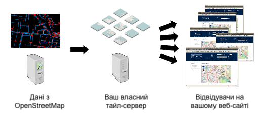

Тайли від сторонніх постачальників&nbsp;– це найпростіший спосіб переходу на OpenStreetMap, до того ж він дозволяє точно виміряти ваші витрати. Однак, якщо ви бажаєте мати повний контроль над долею, ви можете створювати та розповсюджувати ваші власні тайли. В цьому розділі йдеться про те, як це зробити.

# Ви точно цього бажаєте?

І генерація тайлів, і їх розповсюдження вимагають наявності доволі потужного обладнання, особливо, якщо вам треба мати глобальне покриття та регулярні оновлення.

Для розгортання власного тайлового сервера ми радимо використовувати [Ubuntu Linux](http://www.ubuntu.com/).

# Варіанти

1.  [Створення тайлового сервера з сирців](manually-building-a-tile-server-18-04-lts/)
2.  [Розгортання тайлового сервера з пакунків](building-a-tile-server-from-packages/)

# Системні вимоги

Обслуговування власних мап це доволі витратне завдання. В залежності від розміру території, яка вам потрібна та очікуваної кількості трафіка, вимоги до обладнання можуть змінюватись в широкому діапазоні. Переважно, вимагатиметься наявність сховища на 10-12 ГБ, 4 ГБ оперативної пам’яті, а також сучасного двоядерного процесора для середнього міста, або більше 300 ГБ для сховища, 24+ ГБ оперативної пам’яті та не менш ніж чотири-ядерний процесор для всієї планети.

Ми радимо вам розпочати роботу з невеличких частин даних OpenStreetMap&nbsp;– з міста, району чи області. Це краще ніж витратити тиждень на імпорт всього світу (planet.osm) і потім почати все наново після виявлення помилки в налаштуваннях! Ви можете завантажити дані частинами з:

*   [Geofabrik](http://download.geofabrik.de/osm/) (країни та регіони)
*   [Protomaps Extracts](https://protomaps.com/extracts/) (щохвилинні оновлення міст та невеличких країн)

# Інструментарій

Ми використовуємо набір інструментів для створення та обслуговування тайлів.

**Apache**&nbsp;– сервер, який обслуговує звернення від ваших веб-оглядачів та передає їх сервісу **mod_tile**. Крім цього веб-сервер Apache може використовуватись для обслуговування статичного веб-контенту, такого як HTML, JavaScript та CSS для вашої сторінки з мапою.

Після надходження від користувача запиту Apache направляє запит до mod_tile для подальшої обробки. Mod_tile перевіряє, чи тайл вже створено і він готовий до використання або він вимагає оновлення через його відсутність в кеші. Якщо тайл доступний і не потребує створення, він негайно надсилається клієнту. У випадку потреби у його створені, тайл додається в “чергу генерації”, і коли настає його черга, процес генерації тайлів (рендер) створює його та надсилає клієнту.

Для створення тайлів ми використовуємо інструмент з назвою **Mapnik**. Він отримує запити з черги у найшвидший спосіб, витягує дані із різноманітних джерел, відповідно до інформації про стиль, та генерує тайли. Тайл надсилається до клієнта, а Mapnik переходить до наступного запису в черзі.

Для потреб генерації тайлів, дані OpenStreetMap зберігаються в базі даних, яка обслуговується сервером баз даних **PostgreSQL**. Для переміщення даних в базу використовується **osm2pgsql**. Ці два інструменти працюють разом щоб в ефективний спосіб отримувати геопросторові дані OpenStreetMap. Ви можете підтримувати актуальність вашої бази даних PostgreSQL користуючись потоком diff-файлів, які створюються кожні 60 секунд на сервері OpenStreetMap.
